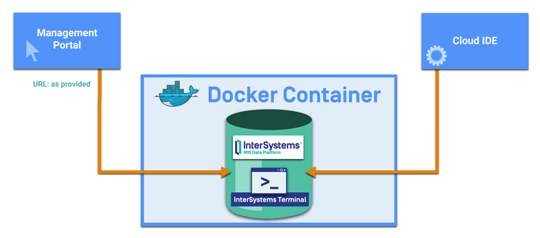

# Welcome to InterSystems Learning Labs!
Congratulations! You now have an instance of InterSystems IRIS for learning or evaluation. Please do not build live solutions on this instance. Please note that some samples may not always follow best practices, as they are designed to teach a specific concept or topic.

Make sure to bookmark this page or access your lab again through [InterSystems Learning Labs](https://learning.intersystems.com/course/view.php?name=Java%20Build)

Want to learn more about InterSystems IRIS? Take a look at [What is InterSystems IRIS](https://learning.intersystems.com/course/view.php?name=InterSystems%20IRIS%20QuickStart) to learn more.

  
## InterSystems Learning Labs Overview
This cloud IDE and your InterSystems IRIS instance are running in separate containers that share file system volumes and therefore have access to the same folders.

This graphic shows how you can connect to InterSystems IRIS directly using the InterSystems Management Portal, use InterSystems IRIS Terminal to open a command line for the InterSystems IRIS instance, or use this cloud IDE (or [any other IDE](https://docs.intersystems.com/irislatest/csp/docbook/DocBook.UI.Page.cls?KEY=AB_idesetup)) to write client-side code. You can also use InterSystems Atelier or Studio to write server-side ObjectScript code. 

## Contents
### In this IDE:
* HelloWorld samples : Demonstrates connecting to InterSystems IRIS from your C#, Java, Python, and Node.js applications.
* Samples-Integration-RedLights : A folder to use with the [Interoperabilty QuickStart](https://learning.intersystems.com/course/view.php?name=Interop%20QS) for passing data into a sample red light integration solution.

### Sample data within InterSystems IRIS:
* Samples-Stock-Data : For use with the [Multi-model QuickStart](https://learning.intersystems.com/course/view.php?name=Multimodel).
* Samples-Petstore-Data : For use with the [SQL QuickStart](https://learning.intersystems.com/course/view.php?name=SQL%20QS)
* Samples-Integration-RedLights : A red light integration solution for use with the [Interoperabilty QuickStart](https://learning.intersystems.com/course/view.php?name=Interop%20QS)

### InterSystems IRIS Credentials:
    Username: tech
    Password: demo

## Get Started
A variety of QuickStarts and First Looks are available to help you quickly try InterSystems IRIS. Start with samples that are already loaded into this instance of InterSystems IRIS and then you can continue with additional [QuickStarts](https://learning.intersystems.com/course/view.php?name=QS) or [First Looks](https://docs.intersystems.com/irislatest/csp/docbook/DocBook.UI.Page.cls?KEY=AFINDEX) to try something else. At any point, you can also go off-trail and build your own application for learning. 

1. You can use several languages to interact with your InterSystems IRIS database, as well as to call and leverage the many tools offered with InterSystems IRIS. To try this, select your preferred language and run the provided HelloWorld sample. 
* [C# HelloWorld README](./Samples-dotnet-helloworld/README.md)
* [Java HelloWorld README](./Samples-java-helloworld/README.md)
* [Node.js HelloWorld README](./Samples-nodejs-helloworld/README.md)
* [Python HelloWorld README](./Samples-python-helloworld/README.md)

2. Using the integration tools of InterSystems IRIS, data can also easily be shared, orchestrated, and transformed. To try this: 
* Open the InterSystems Management Portal: At the top of this page, click InterSystems > Management Portal. 
* Open and view the integration solution: Click Interoperability > Configure > Production and open Demo.RedLights. The production has already been started. When it started, a message was sent through the interface.
* View messages passed through: Select Menu at the top > Message Viewer. 
* Select the top message and click View Full Trace on the right.

A message was consumed by InterSystems IRIS, sent to the Demo.TicketBPL business process, and routed to both the To_Archive application to be stored within InterSystems IRIS for later analytics, as well as the To_TicketApplication business operation which sends data out to an external ticket application.

3. View a variety of other [QuickStarts](https://learning.intersystems.com/course/view.php?name=QS) and [First Looks](https://docs.intersystems.com/irislatest/csp/docbook/DocBook.UI.Page.cls?KEY=AFINDEX) to try more. These examples show a small set of the many features of InterSystems IRIS. With each, you should clone the appropriate repository and view the README in preview mode.

